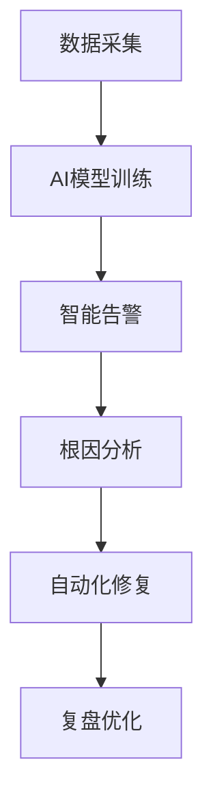

# 5.5 AIOps与智能运维规范

## 一、适用范围与目标
- 适用于所有引入AI/ML能力的监控、告警、日志、自动化修复、容量预测等智能运维场景。
- 目标：提升运维自动化、智能化水平，降低故障率与人力成本。

## 二、管理目标
1. 智能告警、异常检测、根因分析自动化
2. 自动化修复与自愈，提升系统韧性
3. 数据采集、分析、决策智能化，持续优化

## 三、详细规范
- 智能告警与异常检测：采用AI/ML模型进行异常检测、降噪，支持多维聚合、根因分析
- 自动化修复与自愈：结合自动化平台实现故障自愈，支持自动回滚、重启、扩容等操作
- 数据采集与分析：全量采集监控、日志、指标数据，AI/ML模型训练与持续优化
- 决策与辅助：AI辅助运维决策、容量预测、资源调度，智能报表与趋势分析
- 安全与合规：AI模型与数据合规，敏感数据脱敏，模型可解释性

## 四、操作流程
1. 监控/日志/指标数据采集 → AI/ML模型训练 → 部署上线
2. 智能告警触发 → 根因分析 → 自动化修复/自愈 → 记录与复盘
3. 定期模型评估与优化 → 结果归档

## 五、实际案例
- 生产环境引入AI异常检测，告警误报率下降30%，根因分析效率提升
- 自动化自愈脚本结合AI决策，故障恢复时间缩短50%
- 容量预测模型辅助资源扩容，避免业务高峰资源瓶颈

## 六、AIOps流程模板

## 七、注意事项
- AI模型需定期评估，防止“模型漂移”
- 敏感数据需脱敏，模型训练与推理过程合规
- 自动化修复需有回滚与人工干预机制

## 八、参考资料
- 《AIOps智能运维白皮书》
- 《智能告警与根因分析实践》
- 团队内部AIOps实施手册